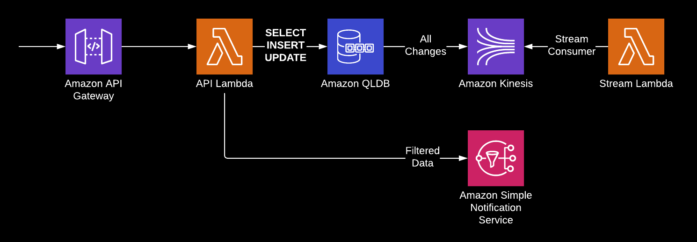

# QLDB Presentation Demo

Simple demo of QLDB Ledger being used for Event Sourcing.
Consists of an API Lambda Function tied to an HTTP API Gateway that talks to a QLDB Ledger and either inserts
or updates the Ledger depending on whether the provided event has a new "id" attribute. A second Lambda function
receives events from the Kinesis Stream for the Ledger and prints all `REVISION_DETAILS` records to the logs.

If the event is new, the received event is sent to an SNS Topic.



The Lambda functions are writen in Python 3.8 and deployed using AWS SAM, and the Serverless Transform automatically 
generates a HTTP API Gateway.

> Although poetry is used for managing dependencies for the project as a whole, 
> there are issues with SAM that made it easier to manually generate requirements.txt files for each Lambda
> function instead of generating them from poetry.lock.

## Templates

* ledger.yaml - creates the Ledger, Kinesis Stream, SNS Topic, and SQS Queue subscribed to the Topic
* template.yaml - SAM Template for Lambda Functions and API Gateway

```
aws cloudformation deploy --stack-name QldbLedger --template-file ledger.yaml

sam build --use-container
sam deploy --guided
```

## Creating the QLDB Table

The Ledger is created via CloudFormation, but the `ApiEvent` table is not.
It can be created in the QLDB Console with these PartiQL commands:

```sql
CREATE TABLE ApiEvent

CREATE INDEX ON ApiEvent (id)
```
